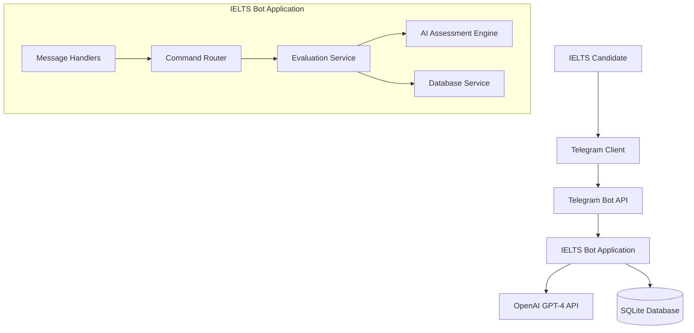

# Design Document

## Overview

The IELTS Writing Evaluation Telegram Bot is designed as a microservice architecture that integrates Telegram Bot API, OpenAI GPT-4 API, and a local database to provide automated IELTS writing assessment. The system follows a layered architecture pattern with clear separation between presentation (Telegram interface), business logic (evaluation engine), and data persistence layers.

## Architecture

### High-Level Architecture



### Technology Stack

- **Bot Framework**: aiogram 3.x (async Python framework for Telegram bots)
- **AI Engine**: OpenAI GPT-4 API
- **Database**: SQLite with SQLAlchemy ORM
- **Web Framework**: FastAPI (for health checks and webhooks)
- **Deployment**: Docker container deployable to Heroku/Render/Railway
- **Environment Management**: python-dotenv for configuration

## Components and Interfaces

### 1. Bot Handler Layer

**Purpose**: Manages Telegram message routing and user interaction flow

**Key Components**:
- `StartHandler`: Processes /start command and displays main menu
- `SubmissionHandler`: Handles text submissions and task type detection
- `HistoryHandler`: Manages band score history requests
- `CallbackHandler`: Processes inline keyboard callbacks

**Interface**:
```python
class BotHandler:
    async def handle_start(message: Message) -> None
    async def handle_text_submission(message: Message) -> None
    async def handle_history_request(message: Message) -> None
    async def handle_callback_query(callback: CallbackQuery) -> None
```

### 2. Evaluation Service Layer

**Purpose**: Orchestrates the writing assessment process

**Key Components**:
- `TaskDetector`: Identifies Task 1 vs Task 2 from content
- `TextValidator`: Validates language, length, and content quality
- `AssessmentOrchestrator`: Coordinates AI evaluation and result formatting
- `RateLimiter`: Manages daily submission limits per user

**Interface**:
```python
class EvaluationService:
    async def detect_task_type(text: str) -> TaskType
    async def validate_submission(text: str) -> ValidationResult
    async def evaluate_writing(text: str, task_type: TaskType, user_id: int) -> AssessmentResult
    async def check_rate_limit(user_id: int) -> RateLimitStatus
```

### 3. AI Assessment Engine

**Purpose**: Interfaces with OpenAI API for writing evaluation

**Key Components**:
- `PromptBuilder`: Constructs task-specific evaluation prompts
- `OpenAIClient`: Manages API communication with retry logic
- `ResponseParser`: Extracts structured data from AI responses
- `ScoreValidator`: Ensures score consistency and validity

**Interface**:
```python
class AIAssessmentEngine:
    async def assess_writing(text: str, task_type: TaskType) -> RawAssessment
    def build_prompt(text: str, task_type: TaskType) -> str
    def parse_response(response: str) -> StructuredAssessment
    def validate_scores(assessment: StructuredAssessment) -> bool
```

### 4. Database Service Layer

**Purpose**: Manages data persistence and retrieval

**Key Components**:
- `UserRepository`: User management and tracking
- `SubmissionRepository`: Writing submission storage
- `AssessmentRepository`: Evaluation results and history
- `RateLimitRepository`: Daily usage tracking

**Interface**:
```python
class DatabaseService:
    async def create_user(telegram_id: int, username: str) -> User
    async def save_submission(user_id: int, text: str, task_type: TaskType) -> Submission
    async def save_assessment(submission_id: int, scores: dict, feedback: str) -> Assessment
    async def get_user_history(user_id: int, limit: int = 10) -> List[AssessmentHistory]
    async def get_daily_submission_count(user_id: int) -> int
```

## Data Models

### User Model
```python
class User:
    id: int (Primary Key)
    telegram_id: int (Unique)
    username: str (Optional)
    first_name: str (Optional)
    created_at: datetime
    is_pro: bool (Default: False)
    daily_submissions: int (Default: 0)
    last_submission_date: date
```

### Submission Model
```python
class Submission:
    id: int (Primary Key)
    user_id: int (Foreign Key)
    text: str
    task_type: TaskType (Enum: TASK_1, TASK_2)
    word_count: int
    submitted_at: datetime
    processing_status: ProcessingStatus (Enum: PENDING, COMPLETED, FAILED)
```

### Assessment Model
```python
class Assessment:
    id: int (Primary Key)
    submission_id: int (Foreign Key)
    task_achievement_score: float
    coherence_cohesion_score: float
    lexical_resource_score: float
    grammatical_accuracy_score: float
    overall_band_score: float
    detailed_feedback: str
    improvement_suggestions: List[str] (JSON)
    assessed_at: datetime
```

### Rate Limit Model
```python
class RateLimit:
    id: int (Primary Key)
    user_id: int (Foreign Key)
    submission_date: date
    submission_count: int
    created_at: datetime
```

## Error Handling

### Error Categories and Responses

1. **API Errors**:
   - OpenAI API timeout/failure → "Assessment service temporarily unavailable. Please try again in a few minutes."
   - Rate limit exceeded → "Service is busy. Please wait a moment and try again."

2. **Validation Errors**:
   - Text too short → "Please submit at least 50 words for accurate assessment."
   - Non-English text → "Please submit your writing in English for IELTS evaluation."
   - Invalid format → "Please send your writing as plain text."

3. **Database Errors**:
   - Connection failure → Continue with evaluation but warn about history tracking
   - Query timeout → Retry with exponential backoff

4. **User Limit Errors**:
   - Daily limit reached → Display upgrade message with Pro benefits
   - Invalid user state → Reset user session and restart interaction

### Error Recovery Strategies

- **Graceful Degradation**: Core evaluation continues even if history tracking fails
- **Retry Logic**: Exponential backoff for transient API failures
- **Circuit Breaker**: Temporary disable AI calls if failure rate exceeds threshold
- **Fallback Responses**: Pre-defined helpful messages for common error scenarios

## Testing Strategy

### Unit Testing
- **Handler Tests**: Mock Telegram message objects and verify response formatting
- **Service Tests**: Test evaluation logic with sample IELTS texts
- **AI Engine Tests**: Mock OpenAI responses and test parsing logic
- **Database Tests**: Test CRUD operations with in-memory SQLite

### Integration Testing
- **End-to-End Flow**: Simulate complete user journey from submission to results
- **API Integration**: Test OpenAI API integration with real but rate-limited calls
- **Database Integration**: Test with actual SQLite database operations

### Performance Testing
- **Concurrent Users**: Test bot handling multiple simultaneous submissions
- **API Rate Limits**: Verify proper handling of OpenAI API rate limits
- **Database Performance**: Test query performance with large datasets

### Test Data Strategy
- **Sample IELTS Texts**: Curated collection of Task 1 and Task 2 examples
- **Edge Cases**: Very short texts, very long texts, non-English content
- **Mock AI Responses**: Standardized assessment responses for consistent testing

## Security Considerations

### Data Protection
- **User Privacy**: Store minimal user data, no personal writing content retention beyond necessary period
- **API Key Security**: Environment variables for OpenAI API keys, no hardcoded secrets
- **Database Security**: SQLite file permissions, no sensitive data in logs

### Rate Limiting and Abuse Prevention
- **Per-User Limits**: 3 submissions per day for free users
- **IP-based Limits**: Additional protection against bot abuse
- **Content Filtering**: Basic checks for spam or inappropriate content

### Deployment Security
- **Environment Isolation**: Separate development, staging, and production environments
- **Secure Configuration**: All sensitive configuration via environment variables
- **Health Monitoring**: Basic health checks and error alerting